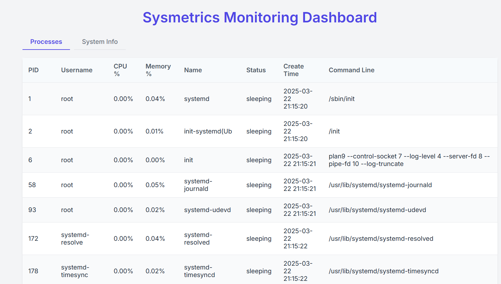

# Metrics Collection Agent

A lightweight agent for collecting system metrics on Linux hosts and exposing them via a RESTful API.

## Overview

This agent collects detailed system metrics including:
- CPU usage and statistics
- Memory and swap usage
- Disk usage, partitions, and I/O statistics
- Process information (PID, name, CPU/memory usage, etc.)
- The agent code is stored under agent folder

Data is collected using Python's `psutil` library, which provides a cross-platform way to retrieve the information.

## Requirements

- Python 3.8+
- Linux environment 
- Network connectivity for API access

## Installation

1. Clone or download the project code
2. Install dependencies:

```bash
pip install -r requirements.txt
```

3. Run the agent:

```bash
python agent/main.py

In browser open url http://localhost:8000/metrics

```

```json
Sample Agent Response
{
  "timestamp": "2025-03-18 16:35:24",
  "hostname": "Host1",
  "ip_address": "127.0.1.1",
  "os_info": "Linux 5",
  "cpu": {
    "percent_usage_per_core": [0, 1, 0, 0, 0, 0, 0, 0, 0, 0, 0, 0, 0, 0, 0, 0, 1, 0, 0, 0, 0, 0],
    "overall_usage": 0.0909090909090909,
    "user": 0.2,
    "system": 0.3,
    "idle": 99.3,
    "cores": 22,
    "physical_cores": 11
  },
  "memory": {
    "total": 33369800704,
    "available": 30727110656,
    "used": 2189152256,
    "free": 30334898176,
    "percent_used": 7.9,
    "swap_total": 8589934592,
    "swap_used": 0,
    "swap_percent": 0
  },
  "disk": {
    "partitions": [
      {
        "device": "/dev/sdd",
        "mountpoint": "/mnt/sda1",
        "fstype": "ext4",
        "total": 1081101176832,
        "used": 18620567552,
        "free": 1007488253952,
        "percent_used": 1.8
      }
    ]
  }
}
```

# SysMetrics Dashboard

The Dashboard app is a Django-based application that collects system metrics from agents and displays them on a central dashboard. Agents return real-time data such as system stats, which is then shown on the dashboard for easy monitoring and analysis.

The code for Dashboard is located under dashboard folder.


## Project Overview

## Prerequisites
- Python 3.8+
- Django 4.2+
- Requests library

## Setup Instructions

1. Clone the repository
```bash
git clone <repo-url>
cd sysmetrics/dashboard
```


2. Install dependencies
```bash
pip install -r requirements.txt
```

4. Configure Settings
- Ensure `http://127.0.0.1:8000/metrics` is accessible

5. Run Migrations
```bash
python manage.py migrate
```

6. Start the Development Server
```bash
python manage.py runserver 0.0.0.0:7000

In browser open url http://localhost:7000
```

## Project Structure
- `dashboard/`: Main application
  - `views.py`: Dashboard and processes views
  - `urls.py`: URL routing
  - `templates/`: HTML templates
  - `static/`: CSS and JavaScript files

## UI



## Notes
- Ensure your metrics API returns data in the expected JSON format
- Chart updates are handled client-side with JavaScript